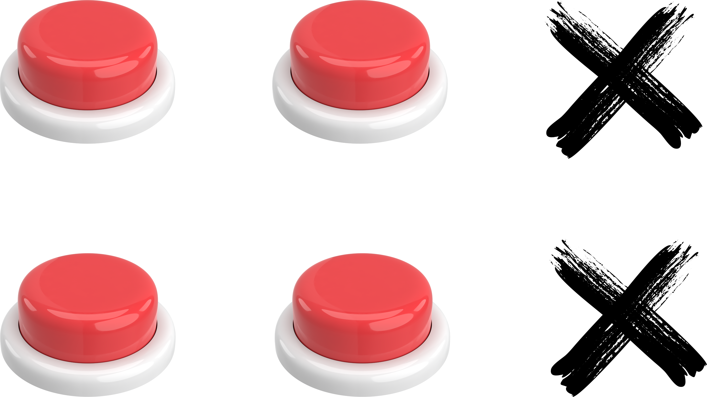

<h1>Remaps automátizados na hora de inicializar jogos kof</h1>
<h2>Vai instalar o programa e vai servir para rodar os jogos que estiver em /userdata/roms/kof-jc</h2>
<h2>O diretório será criado automáticamente durante a instalação</h2>
<br><br>

# Instalação
<br><br>
<h2>Copiar e colar no terminal</h2>

```bash
curl -L https://raw.githubusercontent.com/JeversonDiasSilva/NGO/main/RUN.sh | bash
```
<br><br><br><br><br><br><br><br>
# Jogar em "L" ?

<br><br><br><br>

# # Jogar em "L Invertido" ?

<br><br><br><br>

# # Jogar em "Modo São Paulo" ?

<br><br><br><br>

# # Jogar em "Modo Todos os botões" ?

<br><br>
